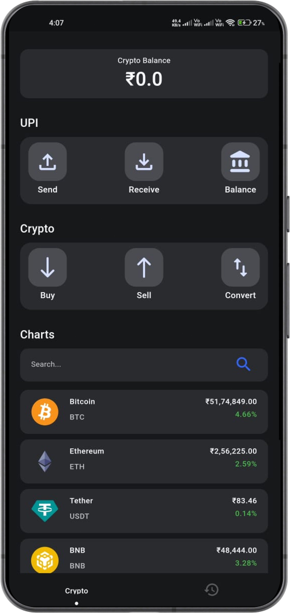
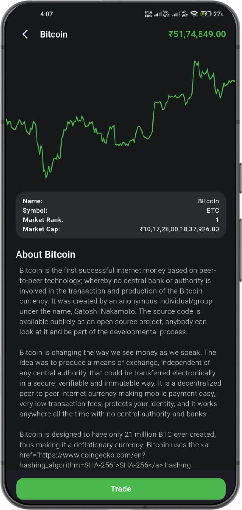
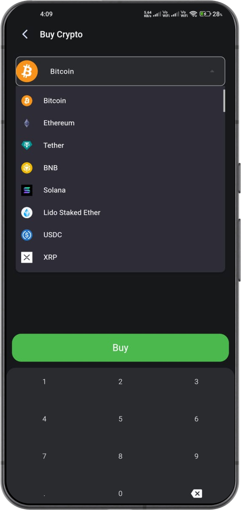
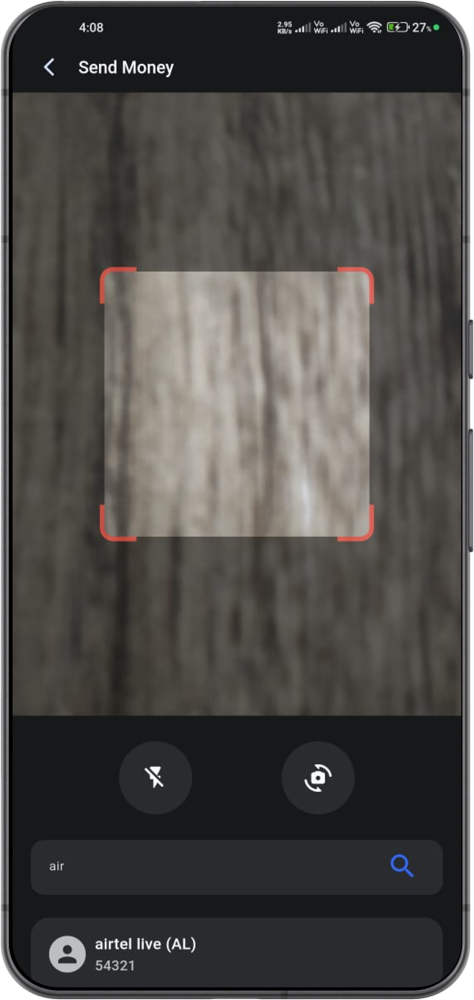
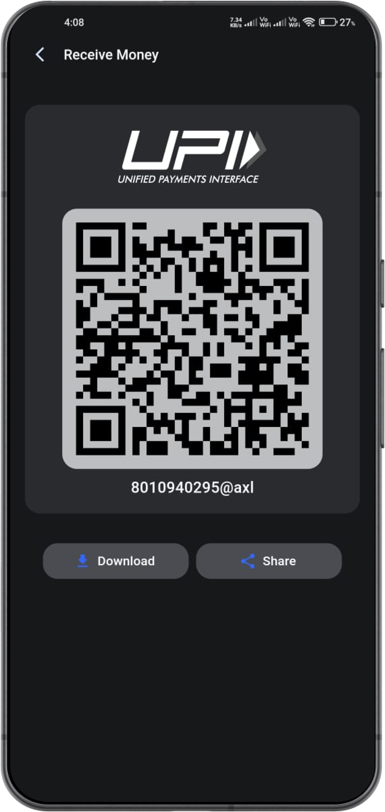

# CryptoTrade Project

## Contact Details

[](mailto:rajsurase3@gmail.com)
[](https://twitter.com/Raj-Surase)
[]([https://www.linkedin.com/in/raj-surase/])
[]([https://www.linkedin.com/in/raj-surase/])

## 1. Introduction

### Project: Cryptocurrency Trading Platform

CrptoTrade is a Cryptocurrency Trading Platform that leverages the CoinGecko API to display real-time cryptocurrency data. Users can trade cryptocurrencies directly on the platform, which links to their bank accounts for secure transactions.

#### Key Features:
- **Real-time Data:** Utilizing the CoinGecko API, the platform provides up-to-date information on cryptocurrency prices, market trends, and trading volumes.
- **Seamless Trading:** Users can trade cryptocurrencies directly on the platform without the need for an external wallet, as the platform links directly to users' bank accounts for secure transactions.
- **Integrated UPI Payment:** The platform supports UPI payments, ensuring quick and secure transactions.
- **User-Friendly Interface:** The platform features a clean and intuitive UI/UX design, making it accessible for both novice and experienced traders.
- **Security:** By linking directly to bank accounts, the platform enhances transaction tracking, ensuring transparency and reducing the risk of illegal activities.

## 2. Technology Stack

- Flutter
- Dart
- CoinGecko API
- SQLite Database

## 3. Apk File

[Download APK](https://drive.google.com/file/d/1-oPxFRBkOaSoOLu87e-69AP9Jmr5sXQi/view?usp=sharing)

## 4. Screenshots








## 5. Steps to Install

```bash
1. Clone the repository:
   git clone https://github.com/CryptoTrade.git

2. Navigate to the project directory:
   cd CryptoTrade
   cd cryptotrade

3. Install dependencies:
   flutter pub get

4. Run the app:
   flutter run
```

## 6. Thank You

Thank you for reading the documentation. Please consider reviewing the project. Your contribution will mean a lot.
